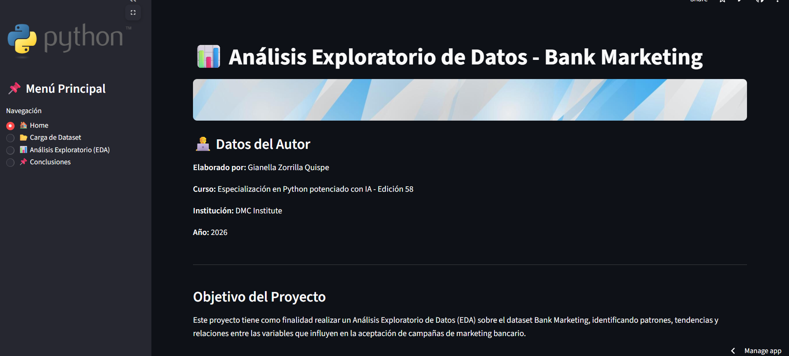
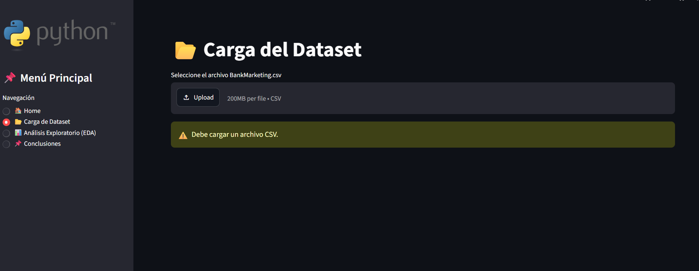
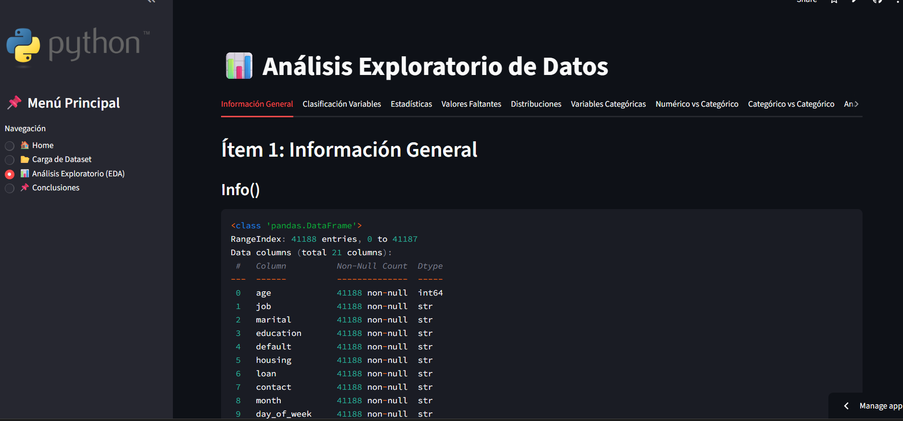

# Proyecto2_GZQ
# 📊 Análisis Exploratorio de Datos - Bank Marketing

## 📌 Descripción del Proyecto

Este proyecto consiste en el desarrollo de una aplicación interactiva utilizando **Python** y **Streamlit** para realizar un **Análisis Exploratorio de Datos (EDA)** sobre el dataset **Bank Marketing**.

El objetivo principal es explorar, visualizar y analizar las características de los clientes de una institución financiera, identificando patrones y relaciones relevantes que permitan comprender mejor el comportamiento de aceptación de campañas de marketing.

La aplicación fue desarrollada como parte de la **Especialización en Python Potenciado con IA - Edición 58**.

---
## 📸 Capturas de la Aplicación

### Home

### Carga del Dataset

### Análisis Exploratorio

---

▶️ Instrucciones de Ejecución
Requisitos Previos

Antes de ejecutar la aplicación, asegúrese de tener instalado:

- Python 3.10 o superior

- Git (opcional, para clonar el repositorio)

1. Clonar el repositorio:
   
git clone https://github.com/studygianella-netizen/Proyecto2_GZQ.git

2. Ingresar a la carpeta del proyecto:
   
cd Proyecto2_GZQ

3. Instalar las dependencias:
   
pip install -r requirements.txt

4. Ejecutar la aplicación:
   
streamlit run app.py

---

## 🔗 Links Relevantes

### Repositorio GitHub
https://github.com/studygianella-netizen/Proyecto2_GZQ

### Aplicación Streamlit
https://proyecto2gzq-bggtfqfapa2gnvki4copa5.streamlit.app/

